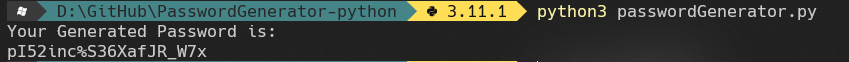

#  Password Generator Using Python

By running the ``.py`` file you will be able to generate a random password with the following characters:
- A / Z (Lower case)
- A / Z (Upper Case)
- 0 - 1 - 2 - 3 - 4 - 5 - 6 - 7 - 8 - 9 (Numbers)
- [] {} # () * ; . _ - ? ¿ ^ % (Symbols)

This password has a default length of 20.

> It should be noted that all characters can be modified from the ``passwordGenerator.py`` (length, symbols, letters and numbers)

## How To Use
1. Clone the repository.
``` 
git clone https://github.com/G3kSec/PasswordGenerator-python.git
```
2. Enter the folder.
```
cd PasswordGenerator-python
```
3. Run the file ``passwordGenerator.py``.
```
python3 passwordGenerator.py
```
4. Done, your password was generated.

